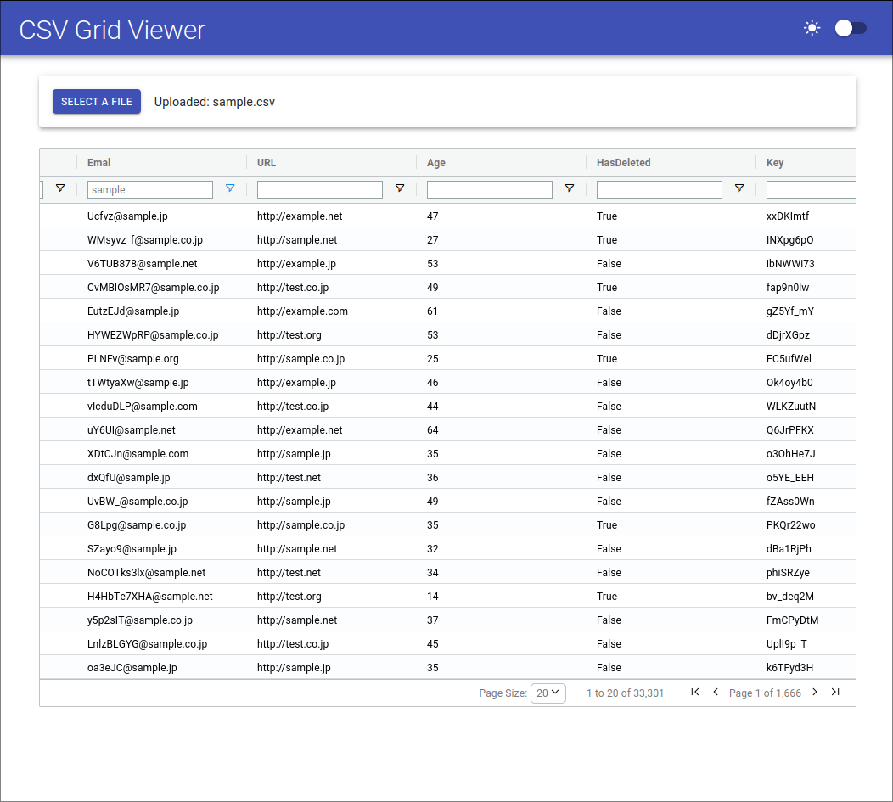
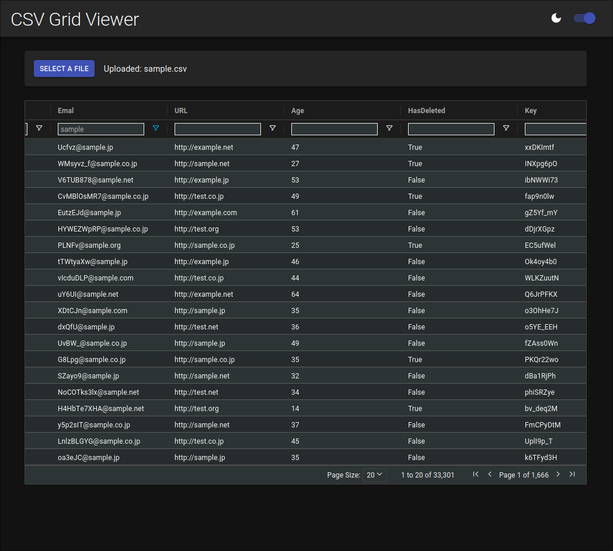

<div align="center">
  
# CSV Grid Viewer

</div>

**CSV Grid Viewer** is a simple CSV grid viewer, built with [React](https://react.dev), [MUI](https://mui.com), [AG-Grid Community Edition](https://www.ag-grid.com/), and [Tauri](https://tauri.app/).

<div align="center" style="display: flex; align-items: center;">
  
  
</div>

## Features

- [x] Allows to load local CSV file 📝
- [x] Sorting and filtering any columns ⏬
- [x] Supports dark mode 🌙

## Installation (TODO)

Download the executables / installers files from the release page.

> [Latest Release](https://github.com/sheepla/csv-grid-viewer/releases/tag/v0.0.1)

## Development

Running `yarn tauri dev`, start a development build of the app.

```sh
yarn tauri dev
```

## Build

Running `yarn tauri build`, AppImage, deb and rpm in `src-tauri/target/release/bundle/`.(Linux)

```sh
yarn tauri build
```

## Author

[sheepla](https://github.com/sheepla)
